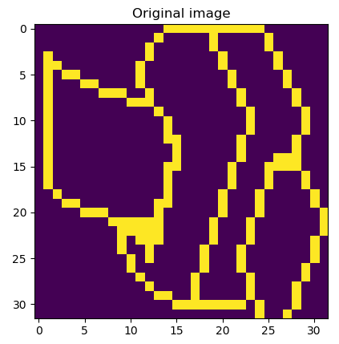
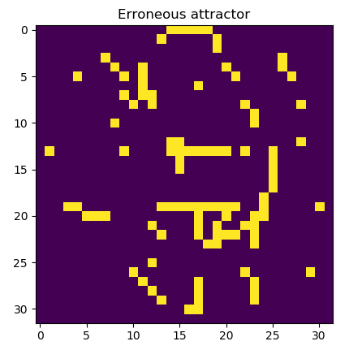
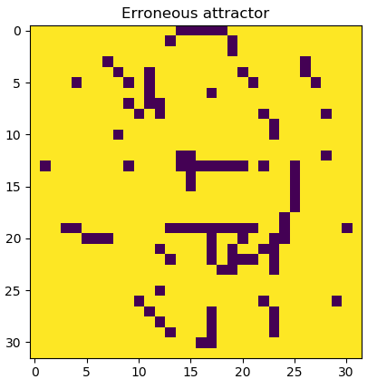
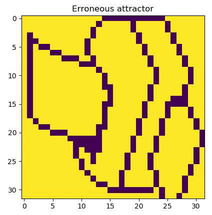
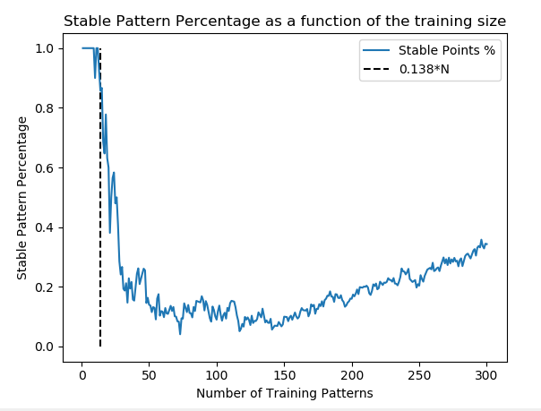

### DD2437_Artificial_Neural_Network_Lab_3

This lab focused on [Hopfield Networks](https://en.wikipedia.org/wiki/Hopfield_network), examining their memory capacity and robustness in retrieving stored patterns (attractors).

Key takeaways:
* Hopefield Networks are simple, yet potent recurrent networks capable of storing patterns, especially useful for denoising inputs.
* These networks learn via the [Hebbian Learning rule](https://en.wikipedia.org/wiki/Hebbian_theory). 
* As energy based systems, they iteratively pass the output of their neurons through the system (output = f(output)), until a stable point is found
(output == f(output)).
* The Sequential and Asynchronous update rules may give different results, given the same input.
* Their memory capacity is hindered by the overlap between the stored patterns. Overlapping patterns generate erroneous (spurious) attractors.
For reference, a Hopfield network of size N can store up to 0.138N (uniformly sampled) patterns. 

## Examples

# Stored image and erroneous attractors

     
 
 # Memory capacity
 
 
