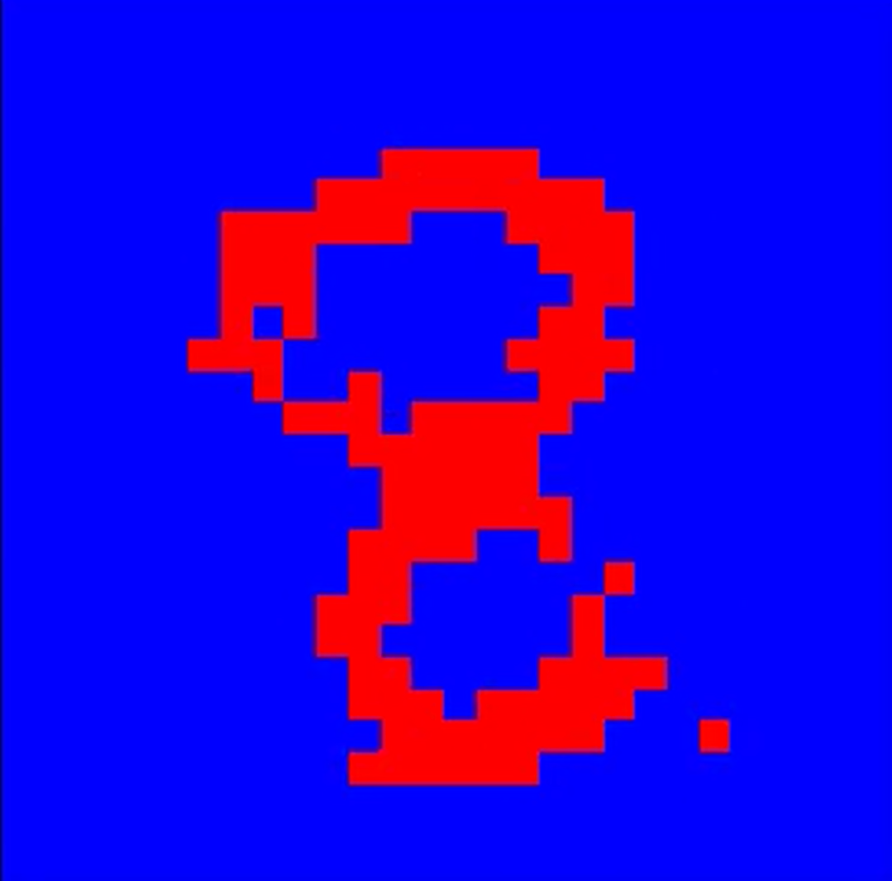

### Lab focusing on Deep Belief Network for classifying and generating MNIST digits dataset

Most of the information about this work can be found in the notes.txt file. Overall, all files generated by my model are located in this directory, excluding the MNIST train Dataset (for size reasons). Files can be easily downloaded here [MNIST](http://yann.lecun.com/exdb/mnist/).

## Examplary results 

# Digit generation

    

    

# Hidden Layer activation (examples) after 500 epochs

|  | 
|:--:| 
| Hidden Layer activation at first iteration (0 epochs) |

|   | 
|:--:| 
| Hidden Layer activation after 50000 iterations (500 epochs)|
   
